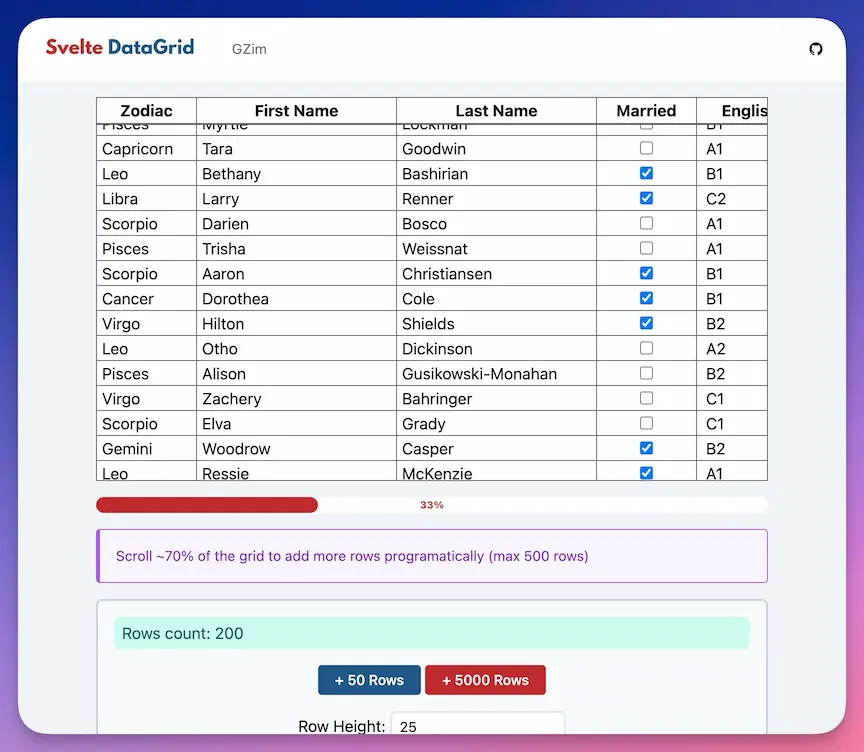

[](https://www.npmjs.com/package/@gzim/svelte-datagrid)

# Svelte DataGrid

Svelte DataGrid is a high-performance, feature-rich grid component for Svelte. It is designed to handle large datasets and provide a smooth scrolling experience. It is also designed to be accessible and customizable.

It's based on the excellent (but deprecated) [svelte-data-grid](https://github.com/bsssshhhhhhh/svelte-data-grid).

## Demo website

[](https://gzimbron.github.io/svelte-datagrid)

## Features

- High scrolling performance
- ARIA attributes set on elements
- Lightweight even when displaying a huge dataset due to implementation of a "virtual list" mechanism
- Column headers remain fixed at the top of the grid
- Custom components can be specified to control how individual table cells or column headers are displayed

## TODO

- [x] Demo website
- [x] Re-ordering columns
- [ ] Resizing columns
- [ ] Feel free to suggest more features or contribute to the project

## Usage:

If using within Sapper:

```bash
npm install @gzim/svelte-datagrid
```

If using from inside a svelte component:

```javascript
import { Datagrid } from '@gzim/svelte-datagrid';

<Datagrid
	columns={columns}
	rows={myRows}
	rowHeight={24}
	on:valueUpdated={onValueUpdated}
	on:scroll={onGridScroll}
/>;
```

Datagrid requires 2 properties to be passed in order to display data: `rows` and `columns`.

`columns` is an array of objects containing at least 3 properties: `label`, `dataKey`, and `width`. A svelte component can be specified in `headerComponent` and `cellComponent` if any custom cell behavior is required.

```typescript
[
	{
		label: 'Name', // What will be displayed as the column header
		dataKey: 'firstName', // The key of a row to get the column's data from
		width: 400 // Width, in pixels, of column
	},
	{
		label: 'Age',
		dataName: 'age',
		width: 150
	}
];
```

`rows` is an array of objects containing the data for each table row.

```javascript
[
	{
		firstName: 'Gustavo',
		age: 34
	},
	{
		firstName: 'Paulina',
		age: 31
	},
	{
		firstName: 'Daphne',
		age: 2
	}
];
```

## Editing Data

You can use this 3 componets as cellComponent to edit data:

Import the components:

```typescript
import { TextboxCell, SelectCell, CheckboxCell } from '@gzim/svelte-datagrid';
```

### Textbox Cell

Textbox cell will debounce the user input.

```typescript
{
  label: 'Name',
  dataKey: 'name',
  width: 250,
  cellComponent: TextboxCell
}
```

### Select Cell

SelectCell requires that you provide an `options` array in your cell definition:

```typescript
{
  label: 'Simpsons Character',
  dataKey: 'simpsonChar',
  width: 200,
  cellComponent: SelectCell,
  options: [
    {
      display: 'Homer',
      value: 'homer'
    },
    {
      display: 'Bart',
      value: 'bart'
    },
    {
      display: 'Lisa',
      value: 'lisa'
    },
    {
      display: 'Marge',
      value: 'marge'
    },
    {
      display: 'Maggie',
      value: 'maggie'
    }
  ]
}
```

### Checkbox Cell

CheckboxCell will set the checked state of the checkbox depending on the boolean value of the row's data.

```typescript
{
  display: 'Pending',
  dataName: 'pending',
  width: 75,
  cellComponent: CheckboxCell
}
```

## Custom Cell Components

To create a custom cell component, create a new Svelte component following the example below.

Components will be passed the following properties:

- `rowNumber` - The index of the row within `rows`
- `row` - The entire row object from `rows`
- `column` - The entire column object from `columns`

MyCustomCell.svelte

```html
<script lang="ts" generics="T">
	import type { GridCellUpdated, GridColumn } from 'datagrid-svelte/types';
	import { createEventDispatcher } from 'svelte';

	type ComponentEventsList = {
		valueUpdated: GridCellUpdated<T>;
	};
	const dispatch = createEventDispatcher<ComponentEventsList>();

	export let row: T;
	export let column: GridColumn<T>;
	export let rowIndex: number;

	const onSomethingHappens = () => {
		dispatch('valueUpdated', {
			row,
			column,
			value: 'newValue',
			rowIndex
		});
	};
</script>

<div class="checkbox-cell" data-row-index="{rowIndex}">ADD HERE YOUR CUSTOM CELL CONTENT</div>

<style lang="postcss">
	.checkbox-cell {
		text-align: center;
	}
</style>
```

Import the component

```typescript
import MyCustomCell from './MyCustomCell.svelte';
```

`columns` option:

```typescript
[
  {
    label: 'Icon'
    dataKey: 'icon',
    width: 300,
    cellComponent: MyCustomCell
  }
]
```

## Custom Header Components

Header components can also be specified in `columns` entries as the `headerComponent` property. Header components are only passed `column`, the column object from `columns`.

```html
<script lang="ts" generics="T">
	import type { GridCellUpdated, GridColumn } from 'datagrid-svelte/types';

	export let column: GridColumn<T>;
</script>

<div class="checkbox-cell"><u>~{ column.label }~</u></div>

<style lang="postcss">
	.checkbox-cell {
		text-align: center;
	}
</style>
```

## Properties:

Datagrid provides a few options for controlling the grid and its interactions:

### Configurations

- `rowHeight` - The row height in pixels _(Default: 24)_
- `extraRows` - Add extra rows to the virtual list to improve scrolling performance _(Default: 0)_
- `allColumnsDraggable` - Set all columns draggable by default, ignoring the `draggable` property of each column _(Default: false)_

### Functions exported

Yoy can bind to the following functions to control the grid:

- `getGridState` - A function that returns the current grid state.

```typescript
const getGridState: () => {
	visibleRowsIndexes: {
		start: number;
		end: number;
	};
	scrollTop: number;
	scrollLeft: number;
	yScrollPercent: number;
	xScrollPercent: number;
};
```

- `scrollToRow` - A function that scrolls the grid to a specific row index.

```typescript
const scrollToRow: (rowIndex: number) => void;
```

### Styling

- `--border` Css: Custom style for grid borders _(Default: 1px)_
- `--header-border` Custom width for header row border bottom _(Default: 2px)_
- `--header-border-color` Custom color for header row border bottom _(Default: black)_
- `--head-bg` Custom background color for header row _(Default: white)_
- `--cell-bg` Custom background color for body cells _(Default: white)_
- `--textbox-cell-bg` ustom background color for textbox cells _(Default: white)_
- `--select-cell-bg` Custom background color for select cells _(Default: white)_
- `--head-color` Custom color for header row text.
- `--cell-color` Custom color for body cells text
- `--textbox-cell-color` Custom color for textbox cells text
- `--select-cell-color` Custom color for select cells text
- `--no-draggable-opacity` Opacity for NOT draggable columns content when dragging. _(Default: 0.4)_
- `--no-draggable-fg` CSS color for NOT draggable columns when dragging, this color is used to create an overlay over the column _(Default: 0.4)_
- `--draggable-bg` CSS Hover color for draggable columns. _(Default: 0.4)_
- `--dragging-bg` CSS Background color for actual dragging column. _(Default: 0.4)_

## Events:

- `scroll` - Triggered when the grid is scrolled on Y axis. The Y scroll percent position can be accessed from `event.detail`
- `xScroll` - Triggered when the grid is scrolled on X axis. The X scroll percent position can be accessed from `event.detail`
- `valueUpdated` - Triggered when a cell's value is updated. The updated value can be accessed from `event.value`, other data can be accessed from `event.row`, `event.column` and `event.rowIndex`
- `columnsSwapped` - Triggered when columns are swapped. `event.detail` contains `from`, `to` and new `columns` order properties

## Bugs? Suggestions?

Please file an issue if you find a bug or have a suggestion for a new feature.
